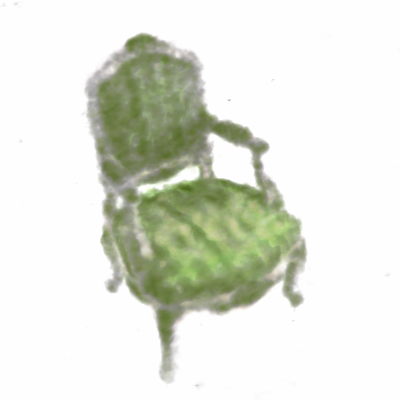

# NeRF With Multiresolution Hash Encoding

This is a pytorch implementation for [Instat NGP](https://nvlabs.github.io/instant-ngp/assets/mueller2022instant.pdf) for coursework of CSC419 geometry processing.

## Installation and Environment

It was tested with 2080ti on windows machine. cuda version 11.8, python version 3.9, torch version 1.13.0+cu117 is recommended.

Conda is recommended to install the dependencies. Use the package manager [pip](https://pip.pypa.io/en/stable/) to install the following:

```bash
conda create -n nerf-hash python=3.9
conda activate nerf-hash

pip3 install torch torchvision torchaudio --extra-index-url https://download.pytorch.org/whl/cu117
pip install imageio
pip install kornia
pip install tqdm
```


## Training Data

Training data needs to be downloaded from [google drive](https://drive.google.com/drive/folders/1JDdLGDruGNXWnM1eqY1FNL9PlStjaKWi) and place in `./data/`

Only blender format is supported. 

## Usage

```python
python run.py
```
Default path to training data is set to `./data/chair`. Default number of iterations is set to 1000. 1000 is a relatively small number, if it does not converge and produce the correct image, try run it again (happens rarely). You can also change data and number of iterations with the following options:

```python
python run.py --data ./data/lego --iter 1200
```

After the training has done, it will render the scene from different angles and dump into the `./out/` folder.

## Training Parameters

Training Parameters and loss function is set to the recommendation in [Instat NGP](https://nvlabs.github.io/instant-ngp/assets/mueller2022instant.pdf) section 4. However, the batch size was set to 1024 because it would converge faster for the lower resolution training task. Parameters are defined in `run.py` and `trainer.py` marked by `# Section 4 training`, feel free to change them.

Convergence is observed within 1000 iterations for most of the time. To reduce the run time, the program is set to run 1000 iterations by default. If not, try run it again or increase the number of iterations. Also increase the number of iterations to get better quality.


## Performance

noted that the quality might have a large variant with small number of iterations (under 5k).

After 1000 iterations:


After 1000 iterations (another run):



After 2000 iterations:


After 3000 iterations:


## Contributions

The load_blender.py was brought from (https://github.com/yenchenlin/nerf-pytorch/blob/master/load_blender.py). It is to load blender format image.

## License

[MIT](https://choosealicense.com/licenses/mit/)